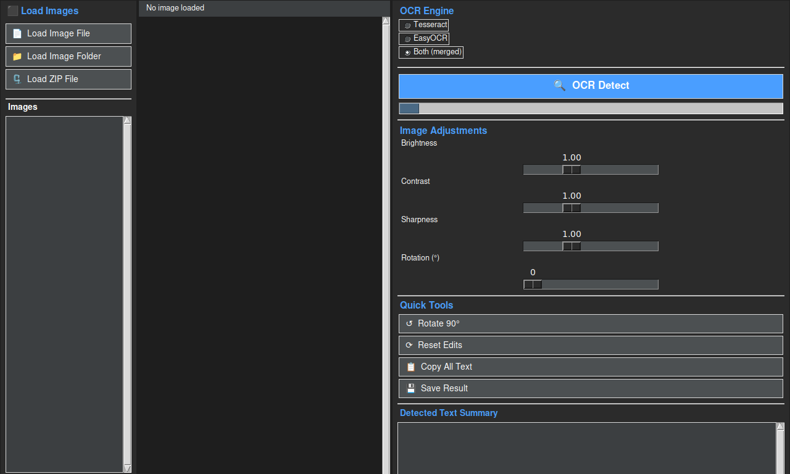
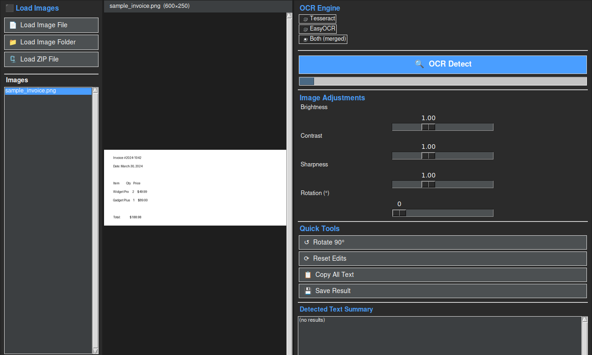
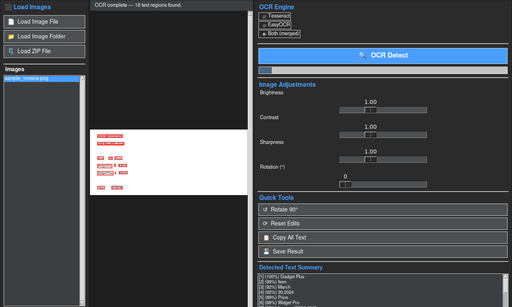

# OCR Bounding Box

A Python desktop application that uses **two OCR engines** — [Tesseract](https://github.com/tesseract-ocr/tesseract) and [EasyOCR](https://github.com/JaidedAI/EasyOCR) — to detect text in images and draw interactive bounding boxes around every word or phrase found.

## Screenshots

### Application startup


### Image loaded in the preview pane


### OCR results with bounding boxes


### Click a bounding box to view / edit its text


---

## Features

| Area | Details |
|---|---|
| **OCR engines** | Tesseract (word-level) · EasyOCR (scene-text) · **Both merged** (IoU-based NMS deduplication) |
| **Image sources** | Single file · Folder · ZIP archive |
| **Bounding boxes** | Clickable red rectangles; click → edit dialog (copy / paste / save text) |
| **Image adjustments** | Brightness · Contrast · Sharpness · Rotation sliders |
| **Export** | Save result image with boxes burned-in at full resolution |
| **Zoom** | Mouse-wheel · Ctrl + / − / 0 |
| **Menu bar** | File · Edit · View · Help with keyboard shortcuts |

---

## Requirements

### System dependency
```bash
sudo apt-get install tesseract-ocr tesseract-ocr-eng   # Debian/Ubuntu
brew install tesseract                                   # macOS
```

### Python packages
```bash
pip install -r requirements.txt
```

`requirements.txt` installs: `pillow`, `pytesseract`, `easyocr`, `opencv-python-headless`, `numpy`.

---

## Usage

```bash
python ocr_app.py
```

1. **Load an image** — use the sidebar buttons (*Load Image File*, *Load Image Folder*, or *Load ZIP File*) or the **File** menu.
2. Optionally tweak the image with the **adjustment sliders** on the right panel.
3. Click **🔍 OCR Detect** — bounding boxes appear over every detected text region.
4. **Click any bounding box** to open the edit dialog where you can view, copy, or correct the text.
5. Use **💾 Save Result** to export the annotated image.

---

## Architecture

```
ocr_app.py          # Single-file tkinter application (~830 lines)
test_ocr_app.py     # 18 unit tests (pytest) – OCR logic, merge, preprocessing
requirements.txt    # pip dependencies
docs/screenshots/   # README screenshots
```

### OCR merge strategy

When **Both (merged)** is selected, results from Tesseract and EasyOCR are combined with a confidence-sorted Non-Maximum Suppression pass: any two boxes with IoU > 0.5 are de-duplicated, keeping the one with higher confidence.

---

## Running the tests

```bash
python -m pytest test_ocr_app.py -v
```
